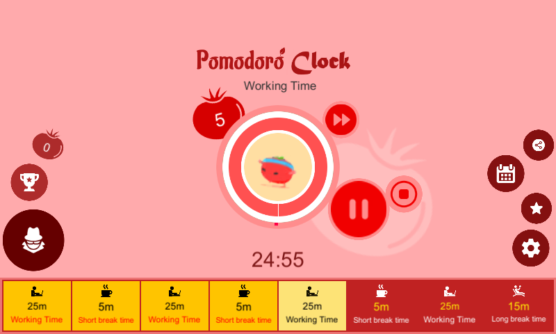

# Pomodoro-Tomato

**Pomodoro Clock – Master Your Time, Boost Your Productivity**  

Have you ever felt like time slips away without achieving your goals? Struggling to stay focused amidst distractions? **Pomodoro Clock** is here to revolutionize how you manage your time, helping you work smarter, stay motivated, and achieve more than ever before.  

**Pomodoro Clock** harnesses the power of the renowned Pomodoro technique, breaking your tasks into focused work intervals paired with strategic breaks. This method not only enhances your productivity but also ensures your brain stays sharp and energized throughout the day.  

### **What Makes Pomodoro Clock Stand Out?**  

#### 1. **Smart Time Management:**  
Pomodoro Clock helps you structure your day by dividing tasks into manageable sessions with regular breaks. This approach keeps you energized, reduces stress, and prevents burnout from prolonged work hours.  

#### 2. **Track Your Progress:**  
With detailed weekly reports, you can monitor your productivity and measure your efficiency. Gain insights into how you use your time and refine your work habits to achieve your goals faster.  

#### 3. **Leaderboard Motivation:**  
Turn your work sessions into a fun challenge with the leaderboard feature. Compete with other users, climb the ranks, and find motivation in striving for improvement every day.  

#### 4. **Background Music for Focus:**  
Say goodbye to dull work sessions. Pomodoro Clock offers a variety of background music tracks designed to enhance focus and creativity. Whether you prefer relaxing tunes or upbeat melodies, there's something to keep you inspired.  

#### 5. **Customizable Settings:**  
Recognizing that no two workflows are the same, Pomodoro Clock lets you adjust work and break intervals to suit your specific needs. Whether you’re a student, a professional, or a creative, the app adapts to your unique schedule.  

#### 6. **Perfect for Everyone:**  
From students preparing for exams to busy professionals managing tight deadlines or freelancers looking to optimize focus, **Pomodoro Clock** is your ultimate productivity companion.  

### **Why Choose Pomodoro Clock?**  
- **Efficient Time Optimization:** Combine science with convenience to maximize your output.  
- **Enhanced Mental Well-being:** Strategic breaks ensure reduced stress and increased creativity.  
- **Develop Healthy Habits:** Build a sustainable routine that balances work and rest.  

**Pomodoro Clock isn’t just an app – it’s your gateway to mastering time, enhancing your quality of life, and achieving your dreams.**  

Download **Pomodoro Clock** today and start transforming the way you work. Success begins with every moment you take control! 🚀